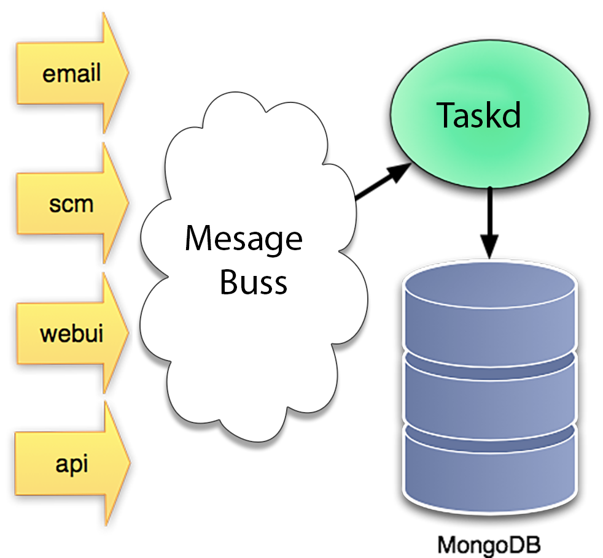
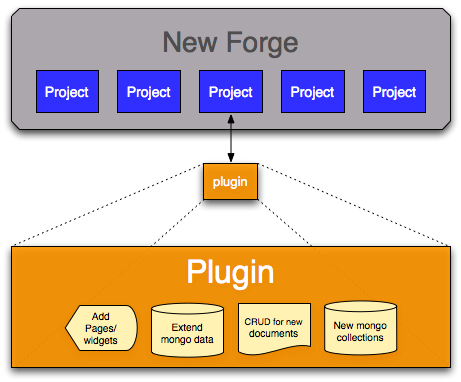

..     Licensed to the Apache Software Foundation (ASF) under one
       or more contributor license agreements.  See the NOTICE file
       distributed with this work for additional information
       regarding copyright ownership.  The ASF licenses this file
       to you under the Apache License, Version 2.0 (the
       "License"); you may not use this file except in compliance
       with the License.  You may obtain a copy of the License at

         http://www.apache.org/licenses/LICENSE-2.0

       Unless required by applicable law or agreed to in writing,
       software distributed under the License is distributed on an
       "AS IS" BASIS, WITHOUT WARRANTIES OR CONDITIONS OF ANY
       KIND, either express or implied.  See the License for the
       specific language governing permissions and limitations
       under the License.

*****************
Platform Overview
*****************

I'm told that the reason you build a platform is to "reduce the marginal cost
of developing applications."  Sounds good.   Well, actually it sounds a bit
dry.  But it's about right, we want to make creating new online development
tools faster, easier, and more fun, which I guess is the "reduce the marginal
cost" thing.

Platform building blocks
------------------------

Before we get into the details of how to extend the Allura platform, perhaps
it would be smart to explain some of the big pieces and why they are there.

We wanted Allura tools to be fast, we needed them to scale, and we had some
complex requirements for data storage and extensibility.  So, we needed a
**fast,** flexible, and easy to use data persistence system.

We were very impressed by the general message architecture of Roundup, but we
wanted to extend it from just email messages to include scm commits, and we
added a message bus, to make it fast.

We were also impressed by the flexibility of Roundup's Hypertable system in
allowing for ad-hock ticket schema additions.

It definitely seemed like something we wanted in a next generation forge,
because we wanted app tools to be able to:

* create and version their own document types,
* extend existing document structures,
* and to mange document revisions, access control lists, and other
  platform level data.

In spite of the power and flexibility of the Roundup HyperTable
implementation, we had some concerns about performance and scalability.

Fortunately several of the Allura authors used MongoDB
in rewriting the download flow of SourceForge.net, and knew that it could
handle huge loads (we saturated a 2gb network connection on the server
with 6% cpu utilization).

We also knew that MongoDB's flexible replication system would allow us
to build the forge in such a way that we could easily provide a
package of all project data to developers concerned about lock-in.

Not only that but Rick Copeland had built a couple of custom Object
*Non*-Relational Mappers (ONRMs?) before, including one for MongoDB,
and he whipped up Ming, which backed on MongoDB and gave us exactly
what we needed.

Application Tools
-----------------

Writing a tool for Allura is as simple as defining a few controllers
to handle particular URL's, templates to render pages, and defining the schemas
of any Allura document types that your tool requires.

When you write Allura tools, you'll get lots of stuff for free:

* Search-ability of your Artifacts
* Artifact versioning for accountability and transparency
* Ability to extend existing Artifacts
* Reuse central User/group/permission management
* A robust and flexible permissions system
* Access to a real-time event publishing system

What's in a tool?
~~~~~~~~~~~~~~~~~

The most basic app tool consists of a few things:

* A controller object (instantiated per request)
* Template files (optional)
* UI Widgets (optional)
* Extensions to existing Artifacts (optional)
* New Artifact types (optional)
* Event listener tools (optional)
* Event publisher (optional)

Users/groups and Permissions
~~~~~~~~~~~~~~~~~~~~~~~~~~~~

In order to facilitate more open processes, where more users can contribute
-- while still protecting data -- documents can easily be "versioned", and
the platform provides tools to manage versioned documents for you.

Why create all the tools as plugins?
------------------------------------

We know that some projects are going to want more locked down
access controls in their bug trackers, or more workflow based
processes.  These things are inevitable, and we really do want
to support them, but at the same time they are going to conflict
with the way many other projects want to work.

Building a plugin (tool in Allura terms) system, and standard
integration points makes it possible to serve everybody in one
way or another.