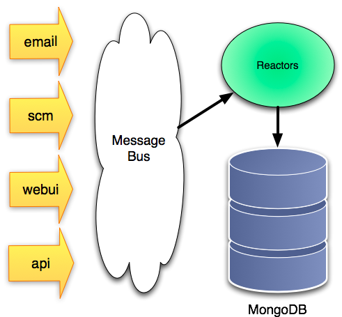

Platform Architecture overview
===================================

I'm told that the reason you build a platform is to "reduce the marginal cost 
of developing applications."  Sounds good.   Well, actually it sounds a bit 
dry.  But it's about right, we want to make creating new online development 
tools faster, easier, and more fun, which i guess is the "reduce the marginal 
cost" thing.

Platform building blocks
---------------------------------------------------------------------

Before we get into the details of how to extend the pyforge platform, perhaps 
it would be smart to explain some of the big pieces and why there are there. 

We wanted PyForge plugins to be fast, we needed them to scale, and we had some 
complex requirements for data storage and extensibility.  So, we needed a 
**fast,** flexible, and easy to use data persistence system.  

We were very impressed by the general message architecture of Roundup, but we 
wanted to extend it from just email messages to include scm commits, and we 
added a message bus (RabbitMQ which we'll talk about in a second), to make 
it fast. 

   
We were also impressed by the flexibility of Roundup's Hypertable system in 
allowing for ad-hock ticket schema additions. 

It definitely seemed like something we wanted in a next generation forge, 
because we wanted app plugins to be able to: 

* create and version their own document types, 
* extend existing document structures, 
* and to mange document revisions, access control lists, and other 
platform level data.  

In spite of the power and flexibility of the Roundup HyperTable 
implementation, we had some concerns about performance and scalability.

Fortunately several of the PyForge authors (including me) used MongoDB 
in rewriting the download flow of SourceForge.net, and new that it could 
handle huge loads (we saturated a 2gb network connection on the server 
with 6% cpu utilization).

We also knew that MongoDB's flexible replication system would allow us 
to build the forge in such a way that we could easily provide a 
package of all project data to developers concerned about lock-in. 

Not only that but Rick Copeland had built a couple of custom Object 
*Non*-Relational Mappers (ONRMs?) before, including one for MongoDB, 
and he whipped up Ming, which backed on MongoDB and gave us exactly 
what we needed. 

As I mentioned before we also needed a fast, flexible message bus and queuing 
system. RabbitMQ was(lightning) fast, (shockingly) flexible, but not supper 
easy to use.   Fortunately we didn't have to roll our own wrapper here, as 
the python community already whipped up Carrot, and Celery, which made 
working with the RabbitMQ based AMQP bus a LOT easer. 

Pluggable Event Listeners
---------------------------------------------------------------------

Have we mentioned Roundup already?   Because here's another idea we stole 
from them: 

**Reactors**

Reactors are just hooks that get called when messages come in.   Nearly 
everything in roundup is implemented as a reactor, and we've tried to do 
the same with PyForge.  Except now reactors are called by a wider variety 
of events...

TODO: Finish reactor overview (after reactor code is written)

Application Plugins
---------------------------------------------------------------------

Writing a plugin for the new forge is as simple as defining a few controllers 
to handle particular URL's, templates to render pages, and defining the schemas 
of any new forge document types that your plugin requires.  

.. image:: _static/images/plugins.png
   :alt: App Plugins
   :align: right

When you write PyForge plugins, you'll get lots of stuff for free: 

* Search-ability of your Artifacts
* Artifact versioning for accountability and transparency
* Ability to extend existing Artifacts
* Reuse central User/group/permission management
* A robust and flexible permissions system
* Access to a real-time event publishing system

What's in a plugin?
~~~~~~~~~~~~~~~~~~~~~~~~~~~~~~~~~~~~~~~~~~~~~~~~~~~~~~~~~~~~~~~~~~~~~

The most basic app plugin consists of a few things: 

* A controller object (instantiated per request)
* Template files (optional)
* UI Widgets (optional)
* Extensions to existing Artifacts (optional)
* New Artifact types (optional)
* Event listener plugins (optional)
* Event publisher (optional)

Users/groups and Permissions
~~~~~~~~~~~~~~~~~~~~~~~~~~~~~~~~~~~~~~~~~~~~~~~~~~~~~~~~~~~~~~~~~~~~~

In order to facilitate more open processes, where more users can contribute 
-- while still protecting data -- documents can easily be "versioned", and 
the platform provides tools to manage versioned documents for you.

